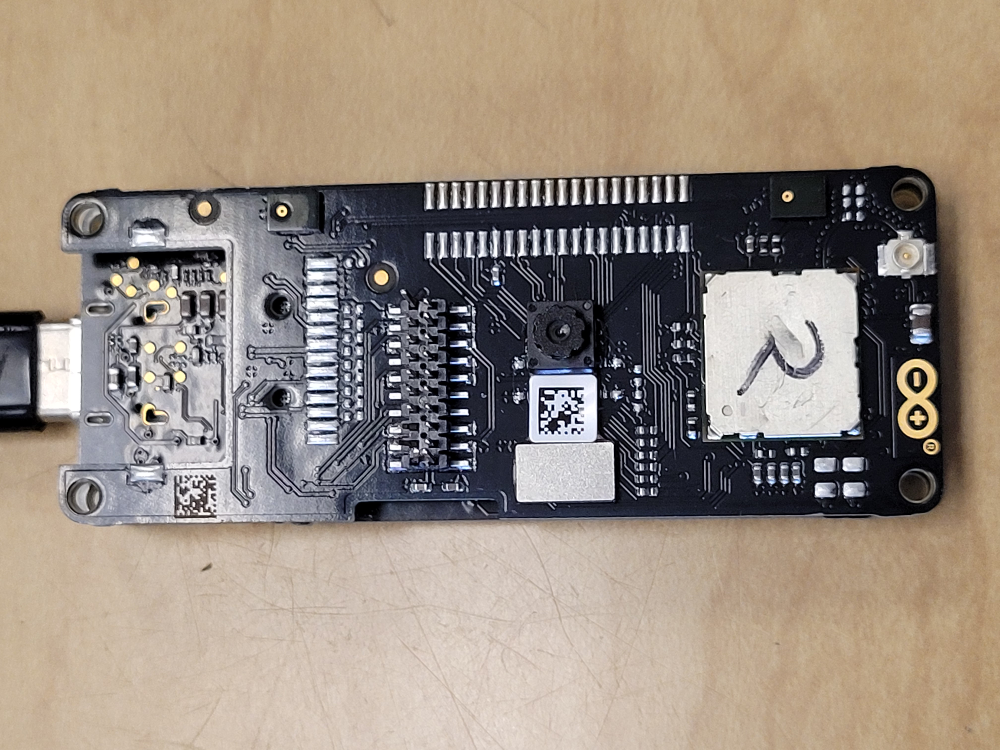
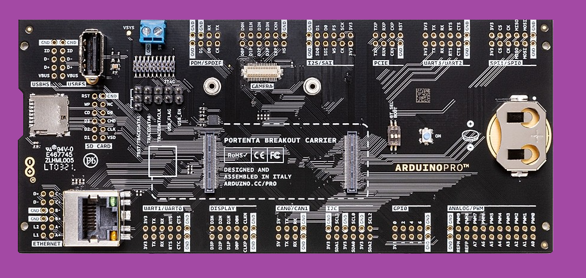

To submit a proposal, please create a pull request that adds a file to this folder, and the file follows this template. Please title your file `proposal-title.md`, replacing `title` with the name of your project.

# Grant Proposal: `Helium and the Arduino Portenta Lora Vision Shield`

**Name of Project:** Helium and the Arduino Portenta Lora Vision Shield

**Proposer:** `hpssjellis`   https://github.com/hpssjellis?tab=repositories

**Do you agree to open source all work you do on behalf of this grant?:**  "Yes" 

# Project Description

- Background: The Arduino Portenta https://store.arduino.cc/usa/portenta-h7 is the new $103.40 USD "Pro" Arduino board with impressive abilities especially when combined with the $63.00 USD LoRa Vision Shield https://store.arduino.cc/usa/portenta-vision-shield-lora  and the optional $45.99 USD Breakout board https://store.arduino.cc/usa/portenta-breakout. The Vision shield with 320px x 320px GRAYSCALE camera and dual microphones brings Machine Learning to DIY, Makers and Professional businesses alike. 

## Arduino Pro PortentaH7

## LoRa Vision Shield

## Optional BreakoutBoard

 

- Problem: Unlike many LoRa capable boards the Portenta does not give direct access to the LoRa module, making most LoRa and LoRaWan example code useless. The Arduino MKRWAn library can connect to the TTN (TheThingsNetwork) In Europe but has some issues connecting in North America.  
- Problem to Solve: Helium connectivity in North America does not work with the present May 2021 Arduino examples. 
- Connecting is only the first step, simple sensors examples are also needed.

- Solution: I plan to simplify getting Portenta sensors and Machine learning working on the Helium Network. 
- First with basic connectivity, then simplifying Cayenne MQTT server presentation of the uploaded data.
-  I have spent several months looking into solutions and now with recent improvements to the Arduino MKRWAN library I have 2 proven methods to connect to Helium in North America

## Deliverables

1. Prove connection to Helium Network using the Arduino Portenta LoRa Vision Shield
2. Present working software on Github for connecting to the Helium network using CayenneLPP and the Adafruit.io dashboard
3. Links to Youtube Video #1 showing how to connect the Arduino Portenta to the Helium Network as above
4. Use an EdgeImpulse Machine Learning model and show the results on the Adafruit.io Dashboard
5. Youtube Video #2 of the above
6. Research other methods of connecting to the helium Network with lower level functionality (Full control of the Murata module that controls the Portenta LoRa chip)
7. Research other MQTT server methods for full control of Web Page results.
8. On going updates for 1 year.

# Final Deliverable: 
A reasonably easy full package of software, with Educational videos for connecting the Arduino Portenta LoRa Vision Shield Machine Learing Solutions to the Helium network.

## Timeline/Roadmap

March 2021 - May 2021: Research LoRa and LoRaWan abilities for the Arduino Portenta Pro LoRa Vision Shield. 2 hours a day for 2 months ~ 120 hours

July 2021: Start Helium Version of Project ~ 60 hours   
Aug 2021: Work on Educational Videos aimed at the large Arduino audience   ~ 60 hours  
Fall 2021: Testing and updating of software  ~ 10 hours  

Milestones

1: Proof of Helium Connection with Arduino PortentaH7 and LoRa Vision Shield  
   By Jeremy Ellis      
   Due: July 15th, 2021  
   Cost: 400 HNT  
   
2. Proof of Helium Machine learning Connectivity with the Adafruit.io Dashboard  
   By Jeremy Ellis      
   Due: July 30th, 2021  
   Cost: 400 HNT  
   

3: Youtube video showing clear instructions to connect the PortentaH7 with vision Shield to Helium and the Adafruit.io dashboard  
   By Jeremy Ellis      
   Due: August 15th, 2021  
   Cost: 400 HNT  
   
4. Youtube video showing clear instructions on how to use a machine learning model with the Helium Network
   By Jeremy Ellis      
   Due: August 30th, 2021  
   Cost: 400 HNT  
   
5. Ongoing updates as needed  
   By Jeremy Ellis      
   Due: June 30th, 2022  
   Cost: 400 HNT  
   
6. Bonus: If time permits: Full accces to the Murata module that controls the LoRa chip on the Vision shield with 
   solutions for MQTT web page displays of Arduino generated data.
   By Jeremy Ellis      
   Due: August 30th, 2021  

      
## Budget

Pay for time spend developing and testing original software.
2 hours a day for 2 months (July, August) at $50 USD an hour = 2 * 60 * 50 = $6000 USD

HNT average from May 2020 to May 2021 = $3.63 USD see [helium04.csv](helium04.csv)
$6000 USD converted to HNT at $3.63 USD per HNT  = 1652 HNT

+348 HNT for Fall 2021 testing and 1 year of updates.

## Total HNT Project request = 2000 HNT to connect the Machine learning capable Arduino Pro Portenta LoRa Vision Shield to the Helium Network with Educational videos showing typical Arduino users how to do it.

## Maintenance

Specify your team's long-term plans to maintain this software and upgrade it over time.

I will maintain this software for 1 year.

# Team

## Members

- Only Team Member: Jeremy Ellis Github: [https://github.com/hpssjellis?tab=repositories](https://github.com/hpssjellis?tab=repositories)
                
                Twitter: https://twitter.com/rocksetta
                 
                Website: https://www.rocksetta.com/ 
                
                Machine Learning using TensorflowJS: https://www.rocksetta.com/tensorflowjs/
                 
                Youtube Arduino Playlist: https://www.youtube.com/watch?v=bVIdH92dcqg&list=PL57Dnr1H_egtm0pi-okmG0iE_X5dROaLw
                
                Robotics Curriculum with Video Series:   https://github.com/hpssjellis/particle.io-photon-high-school-robotics

## Relevant Experience

I have taught coding for 30 years, taught robotics for 7 years, developed my own Robotics curriculum. Taught myself Machine learning, am an Edge Impulse Ambassador https://www.edgeimpulse.com/ Have a class set of Arduino Portenta, with LoRa Vision Shields and Breakout boards for teaching Roboitcs during the next few years. 

